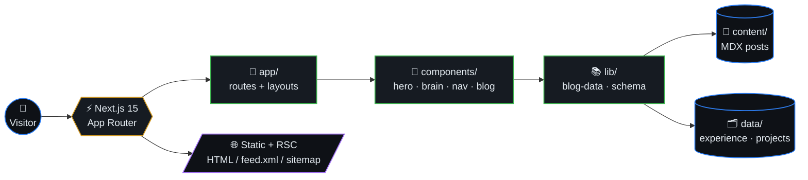
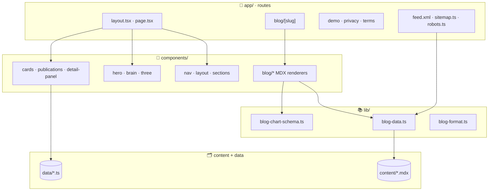

# Portfolio Site

> Personal portfolio + blog built with **Next.js 15**, **TypeScript**, **Tailwind**,
> and **Bun**. A living, evolving space for my work, writing, and side projects —
> with a 3D brain hero, terminal-style nav, and a custom MDX blog pipeline.



## Table of contents

- [My thought process](#my-thought-process)
- [Features](#features)
- [Tech stack](#tech-stack)
- [Architecture at a glance](#architecture-at-a-glance)
- [Development](#development)
- [Project layout](#project-layout)
- [Performance](#performance)
- [What's next](#whats-next)

## My thought process

When designing this site, I wanted it to be more than a digital resume. I aimed
for a platform that reflects my values: clarity, accessibility, and continuous
improvement. Every section is crafted to tell a story — not just of
achievements, but of growth, curiosity, and collaboration.

- **User experience first** — clean, responsive, dark-mode-first design.
- **Transparency** — the codebase doubles as a snapshot of how I work.
- **Open-source spirit** — structured for maintainability and scalability.

## Features

- **About me** — background, education, publications, leadership, OSS work.
- **Experience** — timeline of roles at Polaris Wireless, Apple, Walmart, LBNL,
  and Honda Innovations, each focused on impact and collaboration.
- **Blog** — MDX-driven long-form posts with custom chart schemas.
- **3D brain hero** — Canvas / Three.js wireframe, zero heavy dependencies.
- **Responsive design** — Next.js + Tailwind + Radix UI primitives.

## Tech stack

| Layer | Choice | Why |
|---|---|---|
| Framework | **Next.js 15** (App Router) | RSC, file-based routing, fast builds. |
| Language | **TypeScript** (strict) | Type safety scales with the codebase. |
| Styling | **Tailwind CSS** + Radix UI | Utility-first, accessible primitives. |
| 3D / motion | **Three.js** + Canvas 2D | Custom hero without heavy WebGL deps. |
| Icons | **Lucide React** | Consistent, themeable icon set. |
| Tooling | **Bun** | Fast install, scripts, and test runner. |
| Tests | **Vitest** | Quick unit + link checks pre-build. |

## Architecture at a glance



## Development

This project uses **[Bun](https://bun.sh/)** as the package manager and runtime.
Do not use npm or yarn.

```bash
bun install              # install dependencies
bun run dev              # start dev server (Next.js)
bun run build            # run tests then build for production
bun run start            # start production server
bun run test             # run tests (Vitest)
bun run lint             # run ESLint
bun run resize-logo      # resize public/logo.png to 256×256
bun run generate-favicons # regenerate favicons from public/logo.png
```

## Project layout

```
app/                # Next.js App Router (routes, layouts, RSS, sitemap)
components/         # React components — hero, brain, nav, blog, cards, three
content/            # MDX blog posts
data/               # Typed data — experience, projects, publications
lib/                # Shared helpers (blog data, chart schema, formatters)
hooks/              # Custom React hooks
public/             # Static assets (logo, favicons, OG images)
scripts/            # Bun helper scripts (favicons, logo resize, hooks)
styles/             # Tailwind + global CSS
__tests__/          # Vitest suites
docs/               # Project docs
```

## Performance

- **Logo** — if `public/logo.png` is very large (e.g. 4096×4096), run
  `bun run resize-logo` (uses `sharp` from devDependencies). This resizes to
  256×256 and reduces payload; a backup is saved as `public/logo-original.png`.
  Then run `bun run generate-favicons` if you use custom favicons.

## What's next

- Expand the **Projects** section with write-ups and lessons learned.
- Share more about open-source contributions.
- Continue refining the UI/UX based on feedback.

---

Thanks for visiting! Feedback, questions, or collab ideas welcome. 🚀
