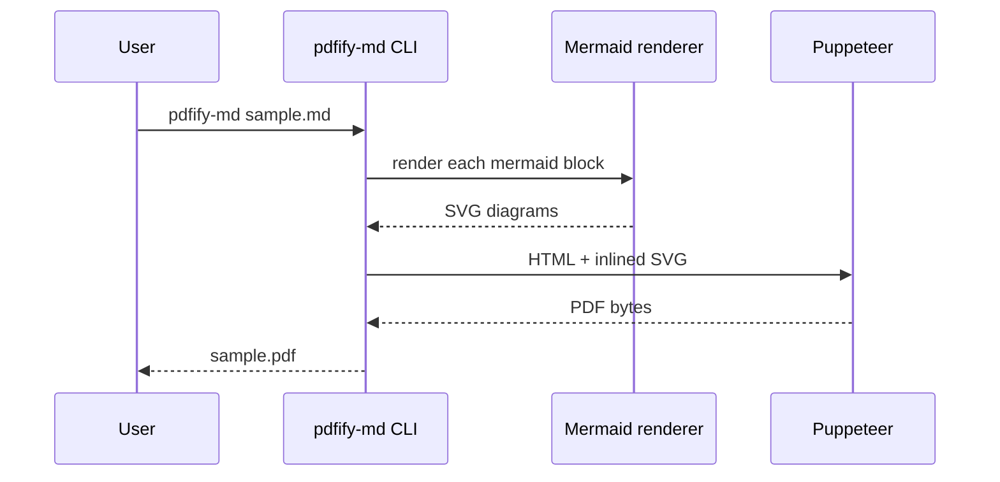

# pdfify-md sample

This file is rendered straight through `pdfify-md`, the CLI and TypeScript
library that turns Markdown — including Mermaid diagrams — into a print-ready
PDF. No mockups here: the PDF and preview beside this file were generated by
running the real tool against this exact source.

## Pipeline


## Request flow



## Supported inputs

| Feature          | Example                     | Notes                          |
|------------------|------------------------------|---------------------------------|
| Headings         | `# Title`                    | Full h1–h6 support              |
| Mermaid diagrams | flowchart, sequence, gantt   | Rendered via headless Chrome    |
| Tables           | this one                     | GFM tables                      |
| Code blocks      | see below                    | Syntax highlighted via highlight.js |

## Code block

```ts
import { generatePdf } from "pdfify-md"

async function build() {
  await generatePdf(["sample.md"], {
    pdf_options: { format: "A4", printBackground: true },
  })
}
```
